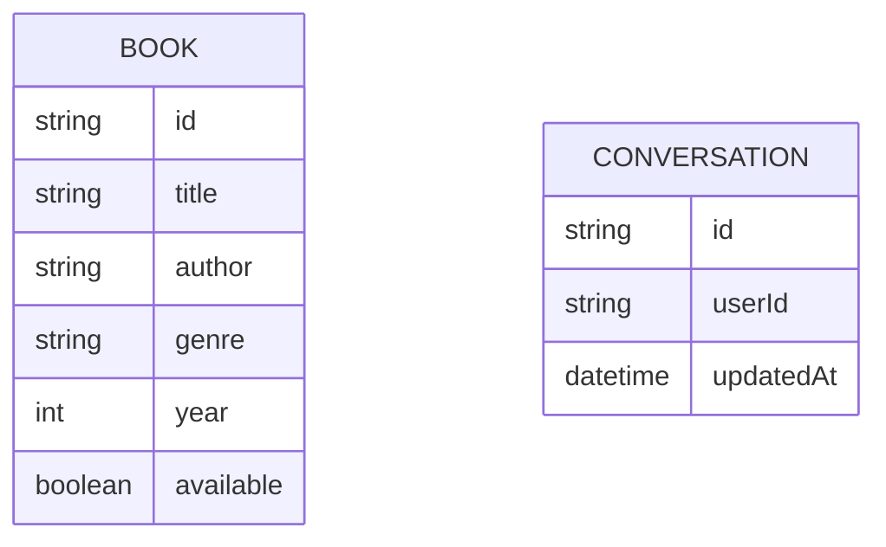

# Domain model

The catalogue is a single entity: a Book, held as static in-memory data by library-service. book-buddy's conversation is its own record, scoped to the signed-in Team Member.

- `BOOK` — one row per catalogue title; seeded once, read-only for the life of the deployment.
- `CONVERSATION` — one row per chat thread book-buddy is holding for a Team Member; owned entirely by book-buddy, never read by library-service.

