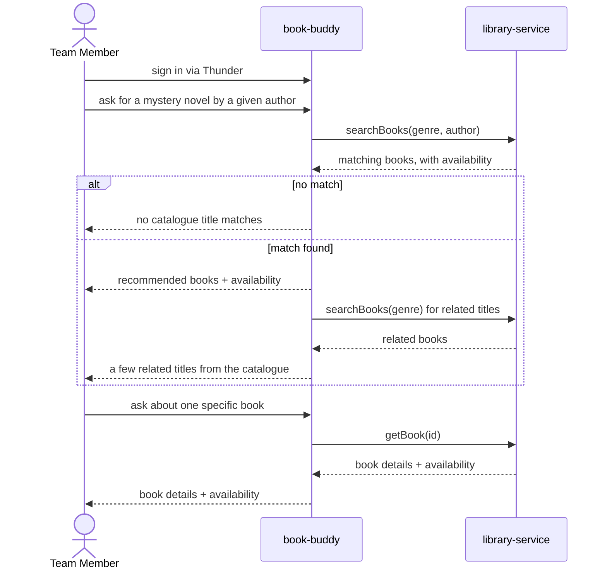

# Find and check a book

A Team Member signs in and chats with book-buddy to find a book by genre or author, check its availability, and see related titles from the catalogue.

```mermaid
sequenceDiagram
    actor TeamMember as Team Member
    participant bookbuddy as book-buddy
    participant library as library-service

    TeamMember->>bookbuddy: sign in via Thunder
    TeamMember->>bookbuddy: ask for a mystery novel by a given author
    bookbuddy->>library: searchBooks(genre, author)
    library-->>bookbuddy: matching books, with availability
    alt no match
        bookbuddy-->>TeamMember: no catalogue title matches
    else match found
        bookbuddy-->>TeamMember: recommended books + availability
        bookbuddy->>library: searchBooks(genre) for related titles
        library-->>bookbuddy: related books
        bookbuddy-->>TeamMember: a few related titles from the catalogue
    end
    TeamMember->>bookbuddy: ask about one specific book
    bookbuddy->>library: getBook(id)
    library-->>bookbuddy: book details + availability
    bookbuddy-->>TeamMember: book details + availability
```

